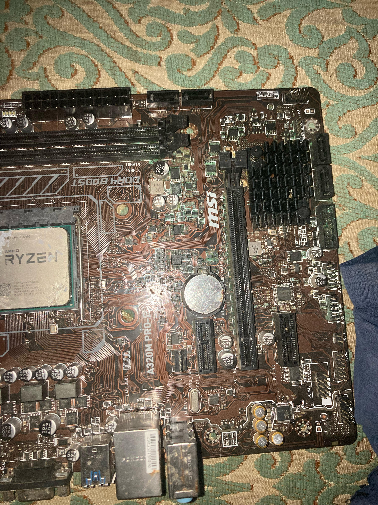
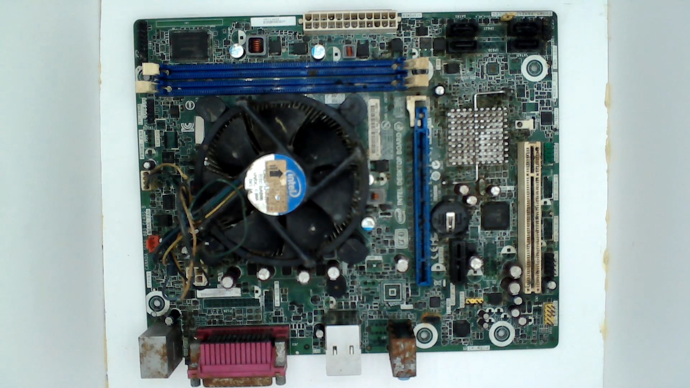
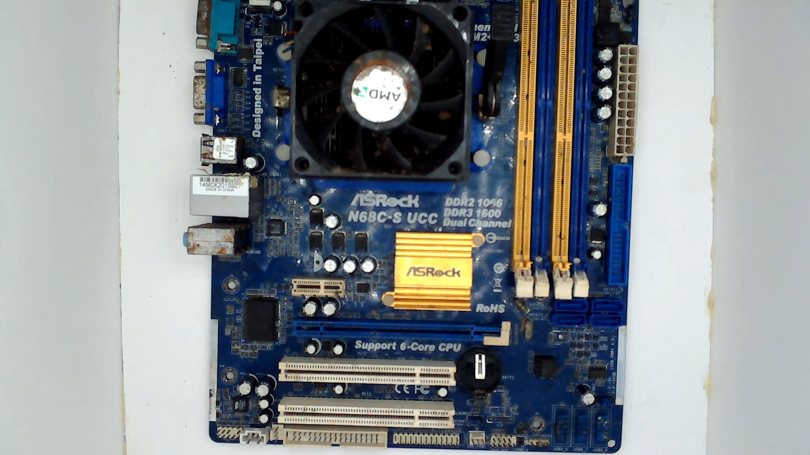

# Waste-to-Wealth

**Waste2Wealth** is an AI-powered motherboard diagnostic engine that uses a custom-trained YOLOv8 model to detect physical defects on PC motherboards (missing components, rust, pin damage, scratches, missing screws, etc.) and estimates the board's repairability and resale value from a single uploaded photo.

## How it works

1. Upload a photo of a motherboard through the web UI.
2. A YOLOv8 model (`best.pt`) scans the image and detects defects.
3. Each detected defect is matched against a severity matrix that assigns a value-loss percentage and repairability impact.
4. The app returns an annotated image (bounding boxes drawn on detected defects) along with:
   - A list of detected defects and their descriptions
   - A repairability verdict (Pristine / Repairable / Unrepairable)
   - An estimated buy-back percentage of the board's original value

## Tech stack

- **Flask** – web server and UI rendering
- **Ultralytics YOLOv8** – object detection model for defect recognition
- **OpenCV / NumPy** – image processing

## Sample output

| Detected defects | Annotated result |
|---|---|
|  |  |



## Running locally

```bash
python -m venv venv
venv\Scripts\activate
pip install -r requirements.txt
python app.py
```

Then open `http://127.0.0.1:5000` in your browser.